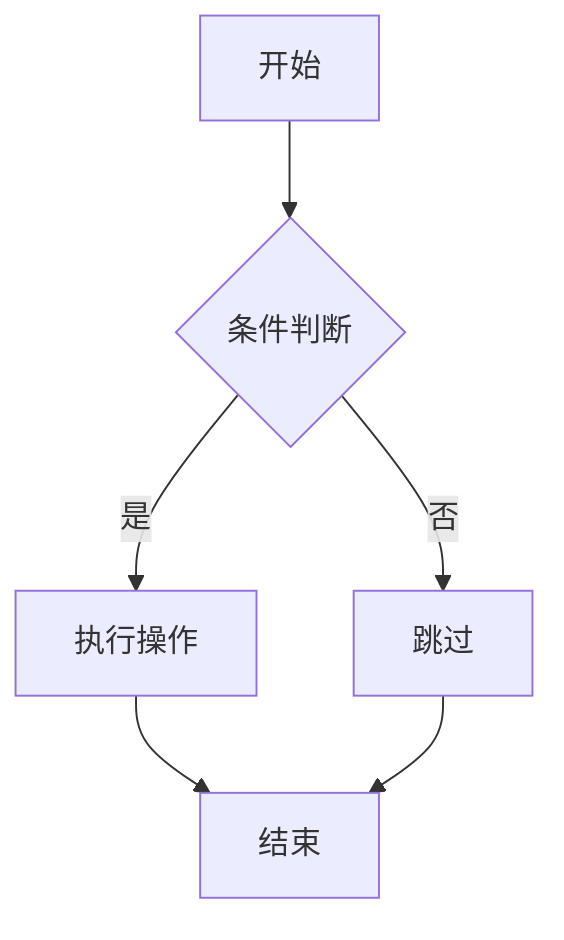
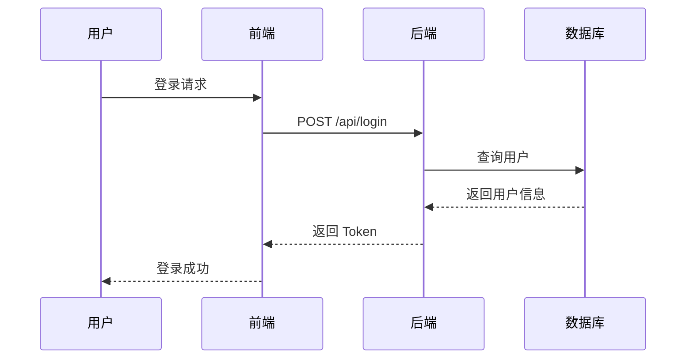
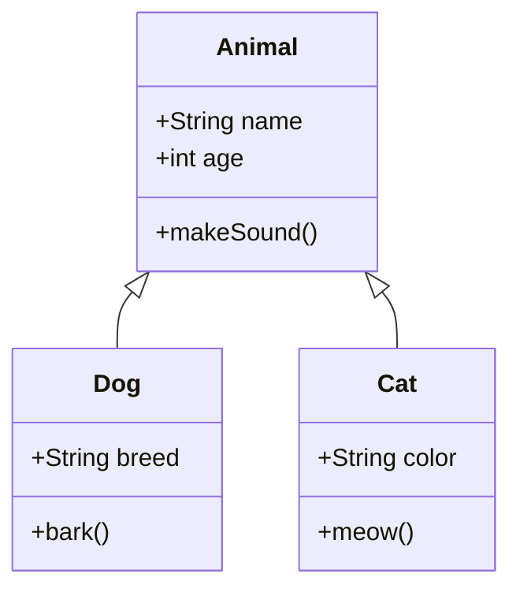

# Milkdown 功能测试清单

## ✅ 待测试功能

### 1. 基础 Markdown（Commonmark）
- [x] 标题（H1-H6）
- [x] 粗体 `**text**`
- [x] 斜体 `*text*`
- [x] 删除线 `~~text~~`
- [x] 行内代码 `` `code` ``
- [x] 链接 `[text](url)`
- [x] 图片 ``
- [x] 引用 `> quote`
- [x] 无序列表 `- item`
- [x] 有序列表 `1. item`
- [x] 分隔线 `---`

### 2. GFM（GitHub Flavored Markdown）
- [x] 表格
- [x] 任务列表 `- [ ] task`
- [x] 自动链接
- [x] 删除线（GFM 风格）

### 3. 数学公式（Math Plugin）
- [ ] 行内公式 `$E=mc^2$`
- [ ] 块级公式 `$$\frac{-b \pm \sqrt{b^2-4ac}}{2a}$$`
- [ ] 复杂公式渲染

### 4. 代码高亮（Prism Plugin）
- [ ] JavaScript 高亮
- [ ] Python 高亮
- [ ] TypeScript 高亮
- [ ] 代码块语言标识

### 5. 图表（Diagram Plugin）
- [ ] Mermaid 流程图
- [ ] Mermaid 时序图
- [ ] Mermaid 类图
- [ ] Mermaid 甘特图

---

## 📝 测试案例

### 数学公式测试

**行内公式：**
质能方程：$E=mc^2$

**块级公式：**
$$
\frac{-b \pm \sqrt{b^2-4ac}}{2a}
$$

**复杂公式：**
$$
\int_{-\infty}^{\infty} e^{-x^2} dx = \sqrt{\pi}
$$

---

### 代码高亮测试

**JavaScript：**
```javascript
function fibonacci(n) {
  if (n <= 1) return n;
  return fibonacci(n - 1) + fibonacci(n - 2);
}

console.log(fibonacci(10)); // 55
```

**Python：**
```python
def quick_sort(arr):
    if len(arr) <= 1:
        return arr
    pivot = arr[len(arr) // 2]
    left = [x for x in arr if x < pivot]
    middle = [x for x in arr if x == pivot]
    right = [x for x in arr if x > pivot]
    return quick_sort(left) + middle + quick_sort(right)

print(quick_sort([3, 6, 8, 10, 1, 2, 1]))
```

**TypeScript：**
```typescript
interface User {
  id: number;
  name: string;
  email: string;
}

function greetUser(user: User): string {
  return `Hello, ${user.name}!`;
}

const user: User = { id: 1, name: 'Alice', email: 'alice@example.com' };
console.log(greetUser(user));
```

---

### Mermaid 图表测试

**流程图：**


**时序图：**


**类图：**


---

### 表格测试

| 功能 | 状态 | 优先级 | 负责人 |
|-----|------|-------|-------|
| 数学公式 | ✅ 已完成 | 高 | Alice |
| 代码高亮 | ✅ 已完成 | 高 | Bob |
| Mermaid图表 | 🚧 进行中 | 中 | Charlie |
| 自定义主题 | 📅 计划中 | 低 | David |

---

### 任务列表测试

- [x] 完成 Milkdown 集成
- [x] 添加数学公式支持
- [x] 添加代码高亮
- [ ] 添加图表支持
- [ ] 添加自定义主题
- [ ] 编写使用文档

---

## 🎨 样式测试

### 混合样式

这是**粗体**，这是*斜体*，这是~~删除线~~，这是`行内代码`。

> 这是一段引用文本，包含**粗体**和*斜体*。
> 还可以有多行。

### 嵌套列表

1. 第一项
   - 子项 A
   - 子项 B
     - 更深层次
2. 第二项
   - 子项 C

---

## 🔗 链接和图片测试

**自动链接：** https://milkdown.dev

**普通链接：** [Milkdown 官网](https://milkdown.dev)

**图片：** 

---

## 📊 测试结果

### 预期结果

1. ✅ 所有基础 Markdown 语法正确渲染
2. ✅ 数学公式使用 KaTeX 美化显示
3. ✅ 代码块有语法高亮
4. ✅ Mermaid 图表渲染为 SVG
5. ✅ 表格美化显示
6. ✅ 任务列表可交互

### 性能指标

- 初始化时间：< 1s
- 大文档渲染：< 2s
- 编辑响应：< 100ms

---

## 🐛 已知问题

记录测试中发现的问题...

---

**测试日期：** 2025-10-23
**测试人员：** AI Assistant
**版本：** v1.0.0


